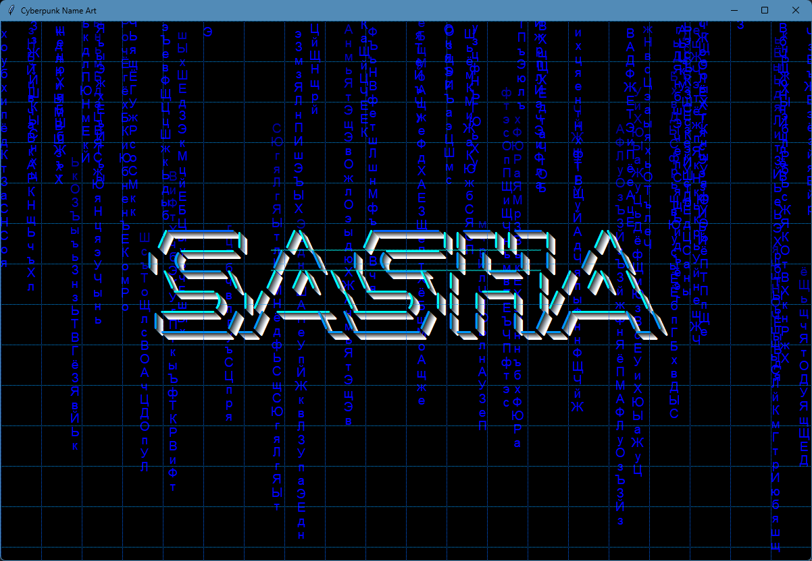

# 🌀 Cyberpunk ASCII Art Generator

Try out the live site: [here]([https://simulated-name-art.replit.app/](https://sz-asc-art-sashazabegalin.replit.app/))

A cyberpunk-inspired ASCII art display featuring animated matrix rain and glowing 3D text effects. Built with Python.

## ✨ Features

- Falling "matrix rain" with Russian characters
- Glowing 3D text effect with dynamic extrusion
- Glitch animations and scanline overlays
- Holographic background patterns
- Smooth animations powered by Tkinter

## 🌐 Web Interface Features
- 40+ language presets including:
  - Japanese, Russian, Arabic, Greek
  - Emoji, Math symbols, Code characters
  - Chinese, Hindi, Korean, and more
- Real-time color pickers
- Responsive design
- Cross-browser compatibility

## 🖥️ Desktop Version Features
- Tkinter-based rendering
- Window positioning control
- Dynamic resolution scaling
- Hardware-optimized animations

## 🛠️ Dependencies
- **Web Version**:
  - Flask
  - pyfiglet
- **Desktop Version**:
  - Tkinter (usually included with Python)

## 🌈 Color Customization
Control these color parameters:
- `main_color`: Primary text glow
- `matrix_color`: Falling characters color
- `bg_color`: Background color
- `hologram_color`: Grid line color

## 🤝 Contributing
Contributions welcome! Please follow these steps:
1. Fork the repository
2. Create your feature branch (`git checkout -b feature/AmazingFeature`)
3. Commit your changes (`git commit -m 'Add some AmazingFeature'`)
4. Push to the branch (`git push origin feature/AmazingFeature`)
5. Open a Pull Request

## 📄 License
Distributed under the MIT License. See `LICENSE` for more information.

